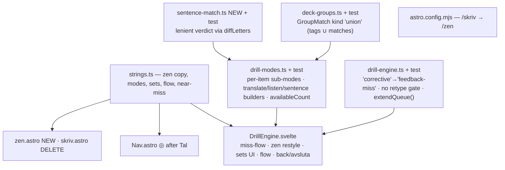

> Revised 2026-07-11 (remote plan session, round 2) after user feedback expanded scope:
> two modes (Översätt back-and-forth / Lyssna Danish-only), multi-select sets + free roam,
> endless flow, and sentence practice with wiggle room. All prior decisions stand.
> Registration on approval: `docs/plans/active/drill-zen.md` (frontmatter from
> `docs/plans/templates/plan.md` — that file has an uncommitted concurrent tweak; use
> as-is, don't touch), committed before implementation. Owner claude-main, branch main.
> `docs/plans/active/` is currently empty — no overlap.

## Context

First real use of `/skriv` + `/tal` surfaced functional misses AND a repositioning: the
word drill's whole point was to be a **zen practice tool**, not a busier flashcards clone.
`/tal` stays its own page ("its cool"); the word drill becomes **"Zen"** — route `/zen`,
nav shows a minimal dot-in-circle icon, full focus-mode calm inside.

Functional misses (user session): "Antal kort" always offers 10/20/40 even with 8 cards;
no way back mid-run; the miss panel repeats the answer up to 3× plus duplicated gloss
lines; after a miss you must click the input again and retype the word to move on.

**User decisions — round 1 (2026-07-11), all still binding:**
- **Zen identity:** name "Zen", route `/zen`, `/skriv` redirects. Nav: dot-in-circle icon
  only (last entry), aria-label/tooltip "Zen — skrivövning". `/tal` keeps its page.
- **After a miss: Enter continues.** Input keeps focus; no forced retype; quiet "Vidare"
  button as pointer path; ~300 ms guard against a held/double Enter.
- **Card count: real count, capped** — options end "Alla (N)"; Starta disabled with
  reason when N=0. (`/tal` keeps 10/20/40.)
- **Miss panel: compact + context** — one colored diff + play button, attempt small,
  Danish example kept, false-friend note kept, duplicates dropped; numbers: one
  `60 · tres` line + play, no digit-diff.
- **Zen scope: whole flow.** Game tone quiet: "4 i rad" (no 🔥), end line
  `85 % · 2:31 · bästa svit 7`, blips stay, CelebrationFlag on completion.

**User decisions — round 2 (this session's feedback + AskUserQuestion):**
- **Two modes:** "Översätt" (back-and-forth: sv→da and da→sv mixed in one run) and
  "Lyssna" (Danish audio only).
- **Sets:** multi-select over lessons AND the flashcards' themed groups (Vardag, Falska
  vänner, praksis themes/POS); "Att repetera" and "Fritt — hela ordförrådet" stay
  standalone source choices.
- **Length: flow default + counts.** Default "Flöde" runs until the user ends it
  (Avsluta/Escape → stats + flag); 10/20/"Alla (N)" remain.
- **Sentences: separate toggle** (Ord | Meningar). Writing/translate: **both directions**
  (sv-sentence→type Danish, da-sentence→type Swedish). Listening: **da→sv only** — hear
  the Danish clip, type the Swedish meaning (the user's own `da->sv` notation; no
  Swedish audio exists, and sentence dictation was not asked for).
- **Wiggle room:** lenient sentence grading — small slips count as right but the diff +
  correct sentence are shown ("aware when they are wrong").
- **Design-swap readiness (round 3):** a Claude design pass will redo the interface
  soon — keep the UI layer easy to swap. Concretely: ALL behavior stays in the pure
  libs (engine/modes/match/groups — already the shape); the component holds only
  wiring, semantic markup and a single style block of token-only CSS (`--sp-*`,
  `--step-*`, `--accent`, `--correct` etc. from global.css — no bespoke values); every
  visible string lives in strings.ts; panels render via named snippets (glossary,
  answerLine, missPanel, nearPanel, setupSection) so a redesign replaces markup without
  touching state or handlers. The zen restyle below is implemented as a LIGHT
  token-based pass — correct structure and calm defaults, no deep visual polish that
  the design pass would throw away.

## Shape of the change

Order: strings → deck-groups → sentence-match → drill-engine → drill-modes → component →
pages/nav/config. `/tal` mounts the same island (kind="numbers") and inherits the run
restyle + miss-panel fixes; its page, sizes (10/20/40) and setup stay untouched.

## Design

### A. Pages, route, nav (unchanged from round 1 — verified)

- `src/pages/zen.astro` = today's `skriv.astro` (same island props + lessons/groups
  logic); `UI.drill.title` becomes "Zen", calm one-line lead. `skriv.astro` deleted.
- `astro.config.mjs`: `redirects: { '/skriv': '/zen' }` (static meta-refresh; Astro
  prefixes `base`; query strings dropped — acceptable, /skriv existed hours; Nav.astro:11
  is the only in-repo link).
- `Nav.astro`: `zen` entry AFTER `tal` with `icon: true` → inline SVG dot-in-circle
  (circle stroke + center dot, `currentColor`, ~1em) + `aria-label={UI.nav.zenLabel}`
  ("Zen — skrivövning"), `title={UI.nav.zen}`, `.vh` text fallback (add the `.vh` rule —
  Nav has none). Active via existing `aria-current` pattern, `match: 'prefix'`.

### B. Engine (`drill-engine.ts` + tests)

- Rename phase `'corrective'` → `'feedback-miss'` (type :10, miss branch :83, doc
  comments). **Delete the corrective-retype branch (:91)** — leaving the phase is the
  component calling `advance()`. `isBlankAttempt` stays for the answering phase; update
  its doc comment (repeat-Enter landing on the next card's answering phase is still
  dropped as blank; the miss panel itself is guarded by the component's 300 ms timer).
- **New `extendQueue(s, items): DrillState`** — appends items to `queue` (pure, no other
  state change; works in any non-done phase). Powers the endless flow top-up. Tests:
  append during answering keeps idx/stats; requeue cap still id-keyed; done unreachable
  while top-ups continue.
- Tests: corrective block rewritten (no retype gate — `submit` in feedback-miss is a
  no-op for both correct and wrong; `advance()` exits it); requeue/cap/missedIds/stats
  semantics unchanged; phase-name updates in mixed-run/immutability tests.

### C. Item model + builders (`drill-modes.ts` + tests, `sentence-match.ts` NEW, `deck-groups.ts`)

- **Per-item sub-mode:** `DrillItem` gains `sub: 'sv-da' | 'da-sv' | 'da-dictation' |
  'sent-sv-da' | 'sent-da-sv' | 'sent-listen' | 'number'`. Input attributes (lang,
  liveRemap, charHelper, label/placeholder), `matches()`, SRS mapping and audio resolve
  PER ITEM from a sub-mode config table (the existing `DRILL_MODES` word entries become
  these sub-configs; the session-level registry shrinks to queue builders). The
  component's `mode.input.*`/`mode.matches` reads become `subConfigOf(current).…`.
- **Session modes (words):** `translate` — build the due/set/free pool once, then per
  card emit ONE item with direction assigned: for the due source, per-direction dueness
  decides (a card due only in `produce` appears sv→da; due in both → the more overdue
  direction); for set/free sources, alternate sv→da / da→sv over the shuffled order.
  SRS writes per item direction (produce/recognize), reusing `buildWordCards`/
  `buildQueue` per direction and merging with dedupe by card id. `listen` — the existing
  `da-dictation` builder verbatim (hear Danish word → type Danish word; unchanged).
- **Session modes (sentences, Ord|Meningar toggle):** pool = cards with `exampleDa` +
  `exampleSv` (listen additionally requires `audioExample` — same predicate as
  session.ts `eligibleForDirection('listen-sentence')`). `translate-sent`: alternating
  `sent-sv-da` (prompt exampleSv → answer exampleDa) and `sent-da-sv` (prompt exampleDa
  + SpeakButton → answer exampleSv). `listen-sent`: `sent-listen` (audio prompt
  exampleDa clip → answer exampleSv; Danish text revealed in feedback). **All sentence
  items are ungraded (no SRS)** — no per-sentence SRS exists; zen practice.
- **`src/lib/sentence-match.ts` (NEW):** `sentenceVerdict(expected, typed):
  'exact' | 'near' | 'wrong'` — exact via `normalizeTyped` equality (+ `foldSwedish`
  second chance, mirroring `matchTyped`); else run the existing `diffLetters` and count
  non-`match` cells: `errors <= max(1, floor(len/12))` → `'near'`, else `'wrong'`.
  Edge punctuation already normalized away; internal punctuation slips land in the
  near-budget. Unit tests: exact, ä/ö-folded exact, 1-typo near, short-sentence
  threshold, clearly-wrong.
- **`deck-groups.ts`:** new `GroupMatch` kind
  `{ kind: 'union'; tags: string[]; matches: GroupMatch[] }`; `matchesGroup` returns
  `tags.some(t => c.tags.includes(t)) || matches.some(m => matchesGroup(c, m))`. The
  drill builds one union match from the selected sets; `buildQueue`'s normal scheduled
  path (due most-overdue-first + `newPerDay` budget) then just works — `'all'` stays the
  only due-only special case, and flashcards never construct `'union'` (behaviorally
  untouched). Tests in deck-groups.test.ts.
- **`availableCount(builder, deps)`** = `buildItems({...deps, size:
  Number.MAX_SAFE_INTEGER}).length` — exact because word/sentence builders end in a
  size slice; throws for the number mode (its generator loops `size * 20`,
  drill-modes.ts:179) + test. Probes drive "Alla (N)" and the N=0 Starta gate.
- **SRS policy:** due/set sources write SRS per word-item direction (as today, one write
  per scored attempt); **free-roam and all sentence items write nothing**. (Observed:
  FlashcardReviewer's free practice DOES write grades despite its "påverkar inte
  schemat" label — looks like a latent bug, noted for a separate fix, not copied here:
  an endless auto-scored flow over 5 000 words must not flood the schedule.)

### D. Component (`DrillEngine.svelte` — the bulk)

- **Setup (calm, stacked):** mode radios "Översätt | Lyssna"; content toggle
  "Ord | Meningar"; source: "Att repetera (förfallna)" · "Fritt — hela ordförrådet" ·
  "Välj set…" — a disclosure with grouped checkboxes (Lektioner / Utvalda /
  Praksis-teman, labels + counts from the existing `buildStudyGroups` + lessons props;
  selected count shown when collapsed). Length picker: "Flöde" (default) · 10 · 20 ·
  "Alla (N)" (counts hidden/irrelevant in Flöde? No — keep the picker; Flöde ignores N).
  `available` probe recomputed token-guarded on mode/content/source/sets change
  (praksis via `ensureDeck()`, extracted from `start()`'s :197–216 block incl.
  startToken guard; `F.loadingDeck` meanwhile); 0 → Starta disabled + matching existing
  empty-state string. A `?tag` deep-link preselects that lesson's checkbox; old
  `?mode=sv-da|da-sv` map to `translate`, `da-dictation` to `listen`.
- **Miss flow (round-1 design, per-item):** entering feedback-miss records
  `missShownAt = performance.now()`; Enter (form submit) and a quiet "Vidare" linklike
  call `continueFromMiss()`: drop if `< 300 ms`, else `advance()` + `afterAdvance()`
  (typed text ignored; input never disabled, re-focused after every phase change via
  the existing `tick().then(() => input?.focus())`). `T.typeItOnce` + render (:671) die;
  `T.continue` as muted panel footer. `isCorrective`/`diff` deriveds → `isMiss`; diff
  gated off for `sub === 'number'`.
- **Near-miss (sentences):** verdict `'near'` submits as correct (combo kept, blip) but
  suppresses the 650 ms auto-advance: a calm panel — `T.nearMiss` ("Nästan rätt — så
  skrivs det:") + colored diff + the correct sentence (+ SpeakButton when the clip
  exists) — waits for Enter/"Vidare" (same 300 ms guard). Word items keep the fast
  650 ms pace.
- **Run = focus mode (light token pass — design will reskin):** drop the `.card`
  border; progress row (:604–607) → 2 px hairline (FlashcardReviewer's
  `.progress-track/-fill`, :579/:707–721; ratio
  `answered / (answered + (queue.length - idx))`) — **hidden in Flöde** (no
  denominator); `.vh` aria-live keeps `T.progress(i, total)` (Flöde: answered count);
  combo as muted `T.inARow(n)` from 2+, no emoji; centered ~30 rem column, prompt
  `--step-3` (sentences wrap — allow `--step-1` for long prompts), large centered
  input, quiet submit, "Visa ordet" muted linklike, `T.enterHint` line (:708) dropped;
  charbar only when the current item's sub-config wants it (Danish-typing items).
  Correct feedback: hairline pulse in `--correct` (replaces `.run.flash`), small ✓,
  clip plays. Motion behind `prefers-reduced-motion`; existing tokens only, no new
  CSS custom properties, no component-local color/size constants.
- **Miss panel (compact + context):** aria-live keeps the full "Rätt svar: X · Du skrev:
  Y" summary as `.vh`; visible: ✗ → colored diff (aria-hidden) + SpeakButton → muted
  `Du skrev: {lastTyped}` → deduplicated glossary (mode-aware `compact` snippet param:
  skip whatever the prompt/hint already shows — sv→da skips `.sv` + `exampleSv`;
  dictation keeps `.sv` + `exampleDa`, drops `exampleSv`; da→sv keeps the existing
  `swedish !== answer` check + `exampleDa`; sentence items skip the example lines —
  the sentence IS the content; `note` always kept) → `T.continue` + existing
  `T.requeued`. Numbers: one `60 · tres` line + replay. Reveal path keeps `answerLine`
  once + dedup glossary.
- **Flow top-up:** component keeps the full built item list; `createDrill` with the
  first 20; in Flöde, when `queue.length - drill.idx <= 3` extend with the next chunk
  (`extendQueue`); when the list runs dry: set/free sources reshuffle and cycle (small
  lessons recycle — that's practice), the due source just ends (backlog drained → done +
  flag).
- **Back / Avsluta + Escape** (Escape checked BEFORE the INPUT-target early-return in
  `onContainerKey`, :420): bounded runs — "‹ Tillbaka", `confirm(T.confirmBack)` when
  `answered > 0`, then clear timer, `player?.stop()`, `drill = null`, focus Starta (new
  `bind:this`), no flag. Flöde — the same control reads "Avsluta": `answered > 0` →
  jump to done (stats + flag, `completedRun = true`), else back to setup.
- **Done:** one calm line `T.doneLine(...)` → `85 % · 2:31 · bästa svit 7` (replaces the
  `<dl class="stats">`), missed list unchanged, `<CelebrationFlag />` when
  `completedRun` (set in `afterAdvance()` on done, and by Avsluta; reset in `start()`).

### E. Strings (`strings.ts`)

Add: `UI.nav.zen`/`zenLabel`; drill `back`, `finishFlow` ("Avsluta"), `confirmBack`,
`sizeAll(n)`, `sizeFlow` ("Flöde"), `inARow(n)`, `continue`, `doneLine(...)`,
`nearMiss`, mode labels `translate`/`listen`, content toggle `words`/`sentences`,
`sourceFree`, `setsLegend`/`setsSelected(n)`, sentence input labels/placeholders.
Retire: `typeItOnce`, drill `enterHint`, `comboLabel`, the three old mode labels.
Retitle `UI.drill.title` → "Zen" + calm `lead`/`description`. Nothing else touched.

## Files (edit order)

1. `src/lib/strings.ts`
2. `src/lib/deck-groups.ts` + `deck-groups.test.ts` — union match
3. `src/lib/sentence-match.ts` (NEW) + `sentence-match.test.ts`
4. `src/lib/drill-engine.ts` + `drill-engine.test.ts` — feedback-miss, extendQueue
5. `src/lib/drill-modes.ts` + `drill-modes.test.ts` — per-item subs, builders,
   availableCount
6. `src/components/DrillEngine.svelte` — everything in D
7. `src/pages/zen.astro` (NEW from skriv.astro) · `skriv.astro` (DELETE) · `tal.astro`
   untouched
8. `src/components/Nav.astro` — ◎ entry
9. `astro.config.mjs` — redirect

Untouched: session.ts (buildQueue reused as-is — the union match lives in deck-groups),
srs.ts, storage.ts, drill-srs.ts, FlashcardReviewer, CelebrationFlag, letter-diff
(reused by sentence-match), global.css, CSVs, scripts, `docs/plans/templates/plan.md`
(concurrent edit — leave).

## Verification

1. `npx vitest run src/lib/drill-engine.test.ts src/lib/drill-modes.test.ts
   src/lib/deck-groups.test.ts src/lib/sentence-match.test.ts`.
2. `npx astro check && npm test && npm run build`; confirm `dist/skriv/index.html` is a
   meta-refresh to `/danishproject/zen/` and `dist/zen/index.html` exists.
3. Playwright pass against `npx astro preview` (Chromium at `/opt/pw-browsers/chromium`;
   harness in the session scratchpad, never the repo):
   (a) nav ends "… Tal ◎", aria-label/title "Zen", aria-current on /zen;
   (b) setup: Översätt|Lyssna + Ord|Meningar; multi-set disclosure picks two sets →
   probe count updates; "Alla (N)" real; emptied due source → Starta disabled + reason;
   (c) translate run mixes directions (assert both a Danish-input item with charbar and
   a Swedish-input item without, input lang/placeholder switching);
   (d) miss flow: focus stays in input (document.activeElement), Enter <300 ms inert,
   Enter after → next card, "Vidare" works;
   (e) sentences: 1-typo answer → "Nästan rätt" panel + diff, combo kept, Enter
   continues; clearly wrong → miss panel; listening sentence plays Danish clip and
   accepts the Swedish meaning;
   (f) Flöde: run past 25 cards (queue tops up), Avsluta/Escape → done + flag + calm
   stats line; bounded run: Tillbaka + Escape → confirm → setup, no flag;
   (g) `/tal` unchanged setup (10/20/40), miss shows one `60 · tres` line, no digit-diff;
   (h) no 🔥 anywhere; hairline progress (hidden in Flöde); free-roam run writes no SRS
   records (inspect localStorage), lesson run does;
   (i) screenshots light/dark × 360 px/desktop; reduced-motion spot-check.
4. Push only on the user's explicit go (plan file committed to
   `docs/plans/active/drill-zen.md` first, then implementation commits).

## Risks / notes

- Scope is ~2× round 1: the per-item sub-mode refactor touches every `mode.*` read in
  the component. Mitigated by the sub-config table keeping the existing word configs
  verbatim.
- The coming design pass makes deep styling waste: this pass delivers structure +
  behavior with token-only CSS and snippet-per-panel markup, so the reskin swaps
  presentation without touching libs, handlers or strings. Playwright asserts behavior
  and semantics (focus, aria, flow), not pixels — screenshots are for the user, not
  gates.
- Sentence da→sv grading leans on one stored Swedish phrasing; the near-threshold
  (`max(1, floor(len/12))` errors) is one constant in sentence-match.ts, easy to tune.
- Endless flow + SRS: only due/set word runs write SRS; free/sentences never — prevents
  schedule flooding. Flashcards' free-practice write-despite-label discrepancy noted as
  a separate future fix.
- Enter-continue 300 ms guard: same idea parked as a flashcards TODO; one constant.
- Redirect drops query strings (meta-refresh) — acceptable.
- Probe cost: ≤5k cards per setup change, same cached praksis JSON Starta uses.
- Focus-mode drops the run-card border — verify `:focus-visible` still reads.

## Close-out (2026-07-11, claude-main)

Implemented in commits 6355be4 (plan registration) + 6c84291 (implementation),
pushed to origin/main on the user's go. Verified: 272 unit tests, `astro check`
clean, `npm run build` clean (redirect page confirmed base-prefixed), and a
~70-assertion Playwright pass against `astro preview` covering the full plan
matrix (nav icon semantics, real-count probes + Starta gating, direction
mixing, miss-flow focus/guard/Vidare, sentence exact/near/wrong, Flöde top-up +
Avsluta/Escape, bounded Tillbaka + confirm, /tal merged miss line, SRS write
policy, reduced motion).

Deviations from the plan: none of substance. One discovery folded in during
implementation: Astro `redirects` does NOT base-prefix the destination (only
the source route), so the config carries `/danishproject/zen` verbatim.

Open follow-ups (not this plan's scope):
- Flashcards "Öva fritt (påverkar inte schemat)" DOES write grades
  (FlashcardReviewer grade() runs unconditionally) — label and behavior
  disagree; needs its own small fix.
- The coming design pass reskins the Zen interface; markup is snippet-per-panel
  and CSS token-only to make that swap cheap.
